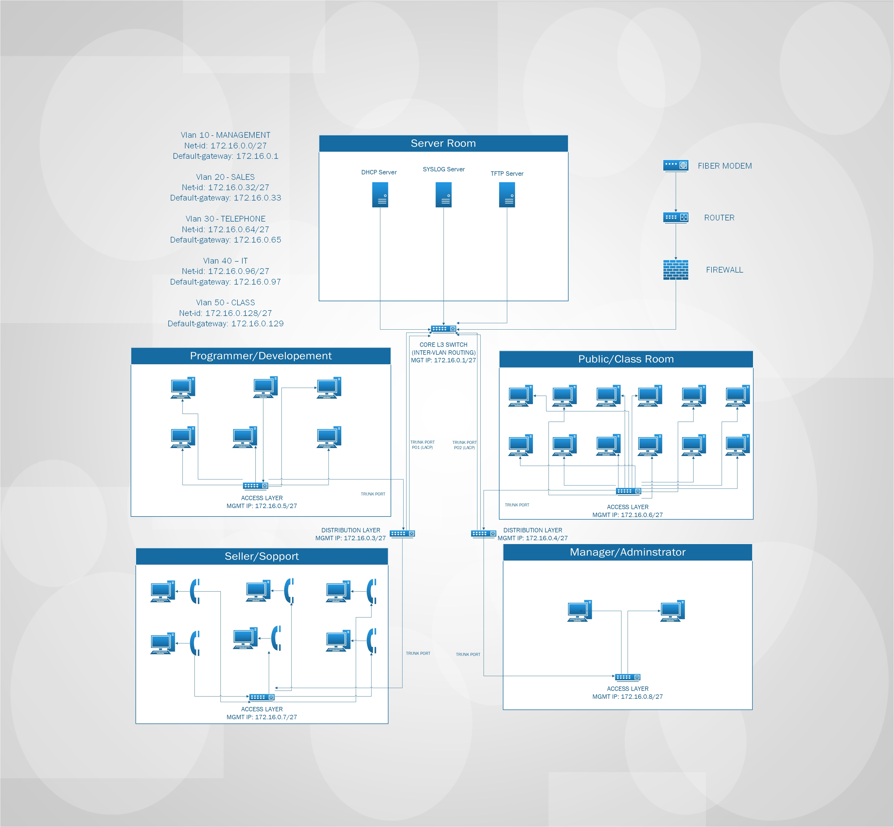

# Enterprise Network Design Project

## Overview
In this project, I designed and implemented a small enterprise network using Cisco technologies. The network is segmented into multiple departments with proper VLAN configuration and inter-VLAN routing.

---

## Network Design
The network follows a hierarchical design model including:

- Core Layer (Layer 3 Switch)
- Distribution Layer
- Access Layer

Each department is placed in a separate VLAN for better performance and security.

---

## Features

- VLAN Segmentation
- Inter-VLAN Routing
- EtherChannel (LACP)
- DHCP Server Configuration
- DHCP Snooping Running
- Syslog Server Implementation
- TFTP Backup for Network Devices
- Port Security Configuration
- Structured Network Topology

---

## Departments (VLANs)

- VLAN 10 - Management
- VLAN 20 - Sales
- VLAN 30 - Voice
- VLAN 40 - IT
- VLAN 50 - Class

---

## Network Topology Diagram

---

## Results

- Successful network connectivity between devices
- Automatic IP assignment via DHCP
- Centralized logging using Syslog
- Configuration backup using TFTP

---

## Project Files

- Packet Tracer file (.pkt)
- Network diagram
- Documentation (PDF)

---

## Future Improvements

- Implement ACL for traffic control
- Add firewall configuration for improved network security
- Enhance network security policies
- Add wireless access to the network for better flexibility

---

## Author

This project was developed as a way to challange my abilities and improve my knowledge in networking. I see this as the first step in a long and continuous learning path.
